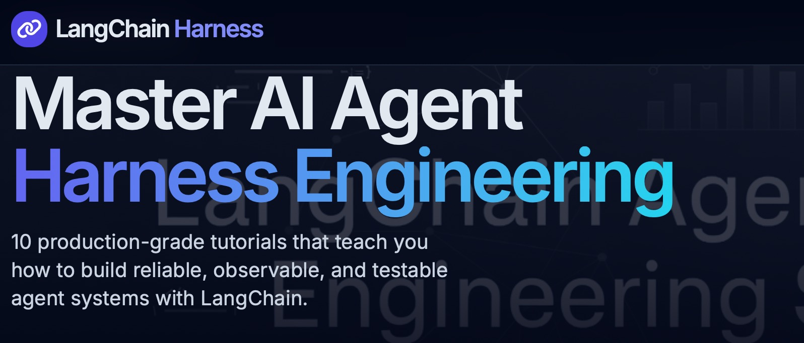

# LangChain Agent & Harness Engineering Showcase

<p align="center">
  
</p>

> **10 progressive, production-minded tutorials** for developers who want to move beyond toy demos and learn how to **engineer reliable AI agent systems**.

**Created and maintained by [Cobus Greyling](https://github.com/cobusgreyling)** — sole author. No other contributors.

This repository is deliberately designed as a **learning harness** itself: clean, well-commented code, explicit failure modes, evaluation patterns, observability hooks, and "harness engineering" principles at every step.

---

## Why This Showcase Exists

Most LangChain tutorials stop at "here is a working agent."  
This showcase teaches you **how to build agents you can trust in real applications**:

- How to make outputs predictable and validated
- How to design tools that don't break your agent
- How to add state, memory, and conversation continuity without leaking context
- How to build an **evaluation harness** so you know when your agent regresses
- How to add guardrails, retries, cost controls, and observability
- How to compose these into a reusable production harness

If you want to go from "I can make an agent say hello" to "I can ship an agent team that I can monitor, test, and improve systematically," this is for you.

---

## Quick Start

```bash
git clone https://github.com/cobusgreyling/langchain-showcase.git
cd langchain-showcase

# Create virtual environment
python -m venv .venv
source .venv/bin/activate   # Windows: .venv\Scripts\activate

pip install -r requirements.txt
cp .env.example .env
# Edit .env and add at minimum OPENAI_API_KEY (or your provider)
```

Run any tutorial directly:

```bash
python tutorials/01-foundation-lcel/tutorial.py
python tutorials/04-react-agent/tutorial.py
python tutorials/07-evaluation-harness/tutorial.py
```

Each tutorial is self-documenting. Read the comments and the per-tutorial notes.

---

## The 10 Tutorials

| #  | Tutorial                              | Focus Area                        | Key Harness Concept                  | Est. Time |
|----|---------------------------------------|-----------------------------------|--------------------------------------|-----------|
| 01 | [Foundation: LCEL & Prompt Composition](./tutorials/01-foundation-lcel) | Chains, runnables, composition   | Composable pipelines as the base harness | 15 min   |
| 02 | [Structured Outputs & Validation](./tutorials/02-structured-outputs)     | Pydantic, with_structured_output | Contracts & schema enforcement       | 20 min   |
| 03 | [Tool Calling Mastery](./tutorials/03-tool-calling)                      | @tool, binding, manual loops     | Reliable tool interfaces             | 25 min   |
| 04 | [ReAct Agents with LangGraph](./tutorials/04-react-agent)                | Agent loop, reasoning + acting   | The core agent harness               | 30 min   |
| 05 | [RAG from First Principles](./tutorials/05-rag-basics)                   | Retrieval, chunking, grounding   | Grounded generation harness          | 35 min   |
| 06 | [Stateful Agents & Memory](./tutorials/06-memory-state)                  | Checkpointers, thread state      | Long-running conversational state    | 25 min   |
| 07 | [Building an Evaluation Harness](./tutorials/07-evaluation-harness)      | Test cases, scoring, reporting   | **The single most important harness** | 40 min   |
| 08 | [Orchestration & Tool Routing](./tutorials/08-orchestration)             | Multi-tool, routing, parallelism | Composing capabilities safely        | 30 min   |
| 09 | [Guardrails & Resilience Patterns](./tutorials/09-guardrails-resilience) | Input/output guards, retries     | Defensive engineering                | 35 min   |
| 10 | [The Complete Production Harness](./tutorials/10-full-harness)           | Everything integrated            | Your reusable agent platform         | 45 min   |

> **Live hosted showcase:** [https://cobusgreyling.github.io/langchain-showcase/](https://cobusgreyling.github.io/langchain-showcase/)

**If you see a 404**, enable GitHub Pages (one-time, very simple):

### How to enable the live showcase page

1. Go to **Settings → Pages** in the repo (or visit https://github.com/cobusgreyling/langchain-showcase/settings/pages)
2. Under "Build and deployment" → **Source**, select **"Deploy from a branch"**
3. Branch: `gh-pages`
4. Folder: `/ (root)`
5. Click **Save**

The site will be live within ~1 minute at the URL above. No Actions needed.

We also have a `gh-pages` branch that contains exactly the showcase files (index.html + assets).

Local alternative (works right after `git clone`):  
[docs/index.html](docs/index.html) or [docs/showcase.html](docs/showcase.html)

**Full visual overview, learning objectives, and key takeaways for every tutorial:**

**[→ Open the live Showcase Page](https://cobusgreyling.github.io/langchain-showcase/)** (recommended)

Local file: [docs/index.html](docs/index.html) (or [docs/showcase.html](docs/showcase.html))

Also available as detailed Markdown: **[SHOWCASE.md](./SHOWCASE.md)**

---

## Learning Path & Philosophy

1. **Do the tutorials in order.** Each one builds directly on concepts and code patterns from the previous.
2. **Read the "Harness Engineering Takeaways"** section at the end of every tutorial. This is where the real value lives.
3. **Break things on purpose.** Every tutorial includes deliberate "what happens if..." experiments.
4. **Extend the harness.** By tutorial 10 you will have the skeleton of a production-grade wrapper you can reuse in your own projects.
5. **Add tracing early.** Uncomment the LangSmith lines. You cannot improve what you cannot see.

### Core Principles Taught Throughout

- **Contracts over prompts** — Use structured output and explicit schemas
- **Tools are part of the interface design**, not afterthoughts
- **State is explicit** — Never rely on magic global context
- **Evaluation is not optional** — If you don't have a harness, you don't have a product
- **Observability > clever prompting** — You will spend more time debugging traces than writing prompts
- **Resilience is engineered**, not prompted

---

## Repository Structure

```
langchain-showcase/
├── README.md                 # You are here
├── SHOWCASE.md               # Detailed tutorial gallery (Markdown)
├── docs/
│   └── showcase.html         # Beautiful interactive showcase page (recommended)
├── requirements.txt
├── .env.example
├── LICENSE                   # MIT — Cobus Greyling, 2026
├── tutorials/
│   ├── 01-foundation-lcel/
│   ├── ...
│   └── 10-full-harness/
│       ├── tutorial.py
│       └── README.md         # Per-tutorial deep notes + exercises
├── harnesses/                # Reusable patterns extracted across tutorials
│   └── base_harness.py       # (Grows with the series)
└── data/                     # Small corpora used by RAG & eval tutorials
```

---

## Who This Is For

- Developers who have done one or two LangChain "hello world" examples and want the next level
- Engineers tasked with shipping agentic features and need battle-tested patterns
- Anyone who believes **agent engineering is 80% harness, 20% clever prompts**
- Teams that want a shared internal curriculum for LangChain / LangGraph

---

## Provider Support

All tutorials default to OpenAI for maximum compatibility and lowest friction.

Clear instructions (and often commented code) are provided to switch to:
- Anthropic Claude
- Google Gemini
- Grok / xAI
- Local models via Ollama

LangSmith tracing works regardless of provider.

---

## Contributing & License

This is a **personal showcase and teaching resource** created by Cobus Greyling.

- Issues and discussion are welcome.
- Significant changes or expansions are considered only if they align with the educational "harness engineering" mission.
- The repository intentionally has a single authorial voice.

See [LICENSE](./LICENSE) (MIT).

---

## Acknowledgments & Further Reading

- The LangChain and LangGraph teams for the incredible foundation
- The broader agent engineering community experimenting in public
- Every developer who has ever said "it worked in the demo and failed in production"

---

**Start here:** [Showcase Page →](./SHOWCASE.md) or jump straight into [Tutorial 01](./tutorials/01-foundation-lcel/tutorial.py).

Built with care by **Cobus Greyling** — 2026.
